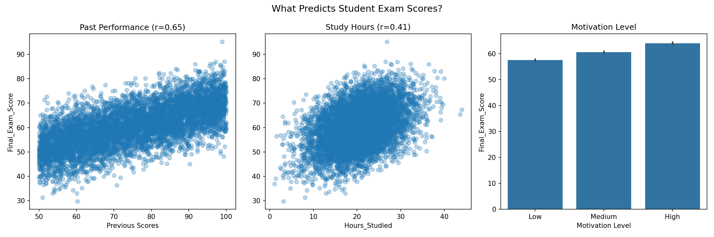

# datenv

# Student Exam Score Analysis

Analysis of 6,607 student records to identify factors that predict final exam performance.

## Dataset
[Student Exam Scores & Study Habits](https://www.kaggle.com/datasets/robiulhasanjisan/student-exam-scores-and-study-habits-dataset) — Kaggle

## Key Findings
- **Past performance** is the strongest predictor of exam scores (r=0.65)
- **Study hours** have a moderate effect (r=0.41)
- **Motivation level** shows a clear 6-point gap between Low and High
- **Parental involvement** and **sleep hours** showed no meaningful effect

## Analysis

## Tools
Python, Pandas, Matplotlib, Seaborn.